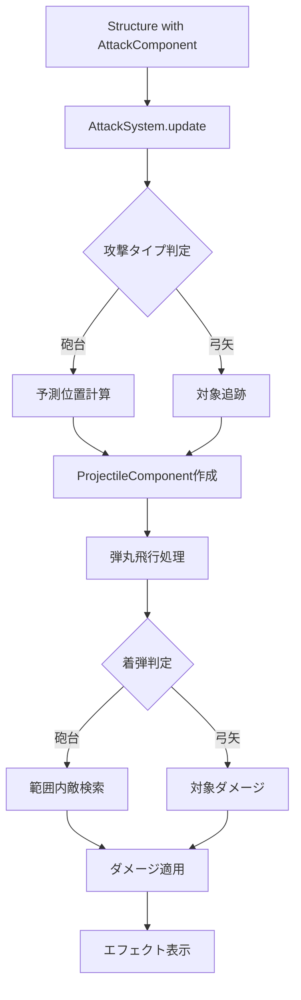

# 設計書

## 概要

既存のAttackComponentとAttackSystemを拡張して、2種類の攻撃タイプ（砲台攻撃と弓矢攻撃）を実装します。砲台攻撃は着弾位置を予測して範囲攻撃を行い、弓矢攻撃は対象を追跡して必中攻撃を行います。

## アーキテクチャ

### 既存システムとの統合

現在のECSアーキテクチャを維持し、以下のコンポーネントとシステムを拡張します：

- **AttackComponent**: 攻撃タイプと関連パラメータを追加
- **AttackSystem**: 弾丸管理と時間差攻撃処理を追加
- **新規ProjectileComponent**: 飛行中の弾丸を管理

### データフロー



## コンポーネントと インターフェース

### 1. AttackComponent拡張

```typescript
export type AttackType = 'direct' | 'artillery' | 'homing';

export type AttackComponent = Component<typeof attackComponentTag, {
  damage: number;
  range: number;
  cooldown: number;
  lastAttackTime: number;
  target?: string;
  // 新規追加
  attackType: AttackType;
  projectileSpeed: number; // 弾丸速度 (pixels/second)
  // 砲台攻撃用
  explosionRadius?: number; // 爆発範囲
  flightTime?: number; // 飛行時間 (seconds)
  // 弾丸の見た目
  projectileSprite?: string;
}>
```

### 2. ProjectileComponent（新規）

```typescript
export type ProjectileComponent = Component<'projectile', {
  attackerId: string; // 攻撃者のID
  attackType: AttackType;
  damage: number;
  speed: number; // pixels/second
  
  // 砲台攻撃用
  targetPosition?: { x: number; y: number }; // 着弾予定位置
  explosionRadius?: number;
  flightTime: number; // 残り飛行時間
  
  // 弓矢攻撃用
  targetEntityId?: string; // 追跡対象のID
  
  // 視覚的要素
  sprite?: Phaser.GameObjects.Sprite;
  trail?: Phaser.GameObjects.Graphics;
}>
```

### 3. AttackSystem拡張

```typescript
export class AttackSystem {
  private projectiles: Map<string, Entity> = new Map();
  
  // 既存メソッド
  public update(currentTime: number): void;
  public executeAttack(attackerEntity: Entity, targetEntity: Entity, currentTime: number): AttackResult;
  
  // 新規メソッド
  private createProjectile(attackerEntity: Entity, targetEntity: Entity): Entity;
  private updateProjectiles(deltaTime: number): void;
  private handleArtilleryProjectile(projectile: Entity, deltaTime: number): void;
  private handleHomingProjectile(projectile: Entity, deltaTime: number): void;
  private explodeProjectile(projectile: Entity): void;
  private findEnemiesInRadius(position: { x: number; y: number }, radius: number): Entity[];
}
```

## データモデル

### 攻撃タイプ設定

```typescript
// 砲台攻撃の設定例
const artilleryAttack = createAttackComponent(
  50,    // damage
  300,   // range
  2.0,   // cooldown
  'artillery', // attackType
  200,   // projectileSpeed
  80,    // explosionRadius
  1.5    // flightTime
);

// 弓矢攻撃の設定例
const homingAttack = createAttackComponent(
  30,    // damage
  250,   // range
  1.0,   // cooldown
  'homing', // attackType
  300    // projectileSpeed
);
```

### 弾丸の状態管理

```typescript
type ProjectileState = {
  id: string;
  position: { x: number; y: number };
  velocity: { x: number; y: number };
  remainingTime: number;
  isActive: boolean;
};
```

## エラーハンドリング

### 1. 弾丸作成時のエラー

- 攻撃者が存在しない場合
- 対象が範囲外の場合
- 無効な攻撃タイプの場合

### 2. 弾丸更新時のエラー

- 対象エンティティが削除された場合
- 弾丸が範囲外に飛んだ場合
- スプライトの作成に失敗した場合

### 3. 着弾処理時のエラー

- 範囲内敵検索の失敗
- ダメージ適用の失敗
- エフェクト表示の失敗

## テスト戦略

### 1. ユニットテスト

#### AttackComponent拡張テスト
- 攻撃タイプの設定と取得
- パラメータの妥当性検証
- コンポーネント作成関数のテスト

#### ProjectileComponentテスト
- 弾丸コンポーネントの作成
- 状態更新の正確性
- ライフサイクル管理

#### AttackSystem拡張テスト
- 弾丸作成ロジック
- 砲台攻撃の予測計算
- 弓矢攻撃の追跡ロジック
- 範囲ダメージの計算

### 2. 統合テスト

#### 砲台攻撃フロー
- 攻撃発動から着弾まで
- 移動する敵への予測攻撃
- 範囲内複数敵へのダメージ

#### 弓矢攻撃フロー
- 攻撃発動から命中まで
- 移動する敵の追跡
- 対象消失時の処理

#### システム間連携
- AttackSystemとMovementSystemの連携
- HealthSystemとの連携
- GameStateSystemとの連携

### 3. パフォーマンステスト

- 大量弾丸の同時処理
- 弾丸スプライトの描画負荷
- メモリリークの検証

## 実装の詳細

### 1. 予測計算アルゴリズム

砲台攻撃の着弾位置予測：

```typescript
function calculateInterceptPosition(
  targetPos: { x: number; y: number },
  targetVelocity: { x: number; y: number },
  projectileSpeed: number,
  flightTime: number
): { x: number; y: number } {
  return {
    x: targetPos.x + targetVelocity.x * flightTime,
    y: targetPos.y + targetVelocity.y * flightTime
  };
}
```

### 2. 弾丸軌道計算

```typescript
function updateProjectilePosition(
  projectile: ProjectileComponent,
  deltaTime: number
): void {
  if (projectile.attackType === 'artillery') {
    // 放物線軌道（簡略化）
    const progress = 1 - (projectile.flightTime / projectile.originalFlightTime);
    const height = Math.sin(progress * Math.PI) * 50; // 最大高度50px
    
    projectile.position.y -= height * deltaTime;
  } else if (projectile.attackType === 'homing') {
    // 追跡軌道
    const target = getTargetEntity(projectile.targetEntityId);
    if (target) {
      const direction = calculateDirection(projectile.position, target.position);
      projectile.velocity = multiplyVector(direction, projectile.speed);
    }
  }
}
```

### 3. 範囲ダメージ処理

```typescript
function applyExplosionDamage(
  center: { x: number; y: number },
  radius: number,
  damage: number,
  attackerId: string
): void {
  const enemiesInRange = findEnemiesInRadius(center, radius);
  
  for (const enemy of enemiesInRange) {
    const distance = calculateDistance(center, enemy.position);
    const damageMultiplier = Math.max(0.3, 1 - (distance / radius));
    const finalDamage = Math.floor(damage * damageMultiplier);
    
    applyDamage(enemy, finalDamage);
  }
}
```

### 4. 視覚エフェクト

#### 弾丸軌跡
- 砲台：放物線軌道の表示
- 弓矢：直線軌道の表示

#### 着弾エフェクト
- 砲台：爆発エフェクトと範囲表示
- 弓矢：命中エフェクト

#### パーティクルシステム
- 爆発時の破片
- 弾丸の軌跡

## パフォーマンス考慮事項

### 1. オブジェクトプール活用

```typescript
class ProjectilePool {
  private pool: Entity[] = [];
  
  public getProjectile(): Entity {
    return this.pool.pop() || this.createNewProjectile();
  }
  
  public returnProjectile(projectile: Entity): void {
    this.resetProjectile(projectile);
    this.pool.push(projectile);
  }
}
```

### 2. 計算最適化

- 範囲検索の空間分割
- 弾丸更新の差分計算
- 不要なスプライト更新の削減

### 3. メモリ管理

- 弾丸スプライトの適切な破棄
- イベントリスナーのクリーンアップ
- 参照の循環回避