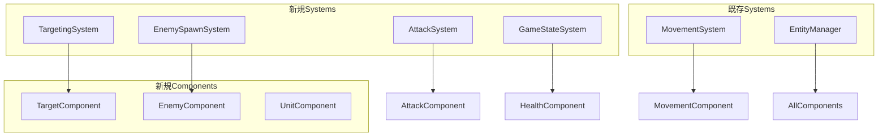
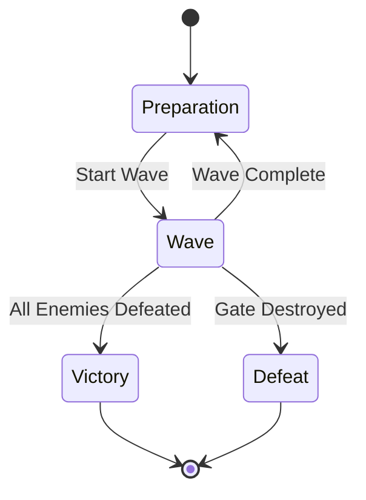

# Design Document

## Overview

このドキュメントは、既存のECSアーキテクチャを基盤としたタワーディフェンス型RTSゲームのコアゲームプレイ機能の設計を定義します。現在のPhaser.js + ECSシステムを拡張し、敵の自動生成、砲台への味方配備、リアルタイム戦闘、勝敗判定を実装します。

## Architecture

### 既存システムとの統合

現在のECSアーキテクチャを活用し、以下の既存コンポーネントとシステムを拡張します：

- **既存Component**: `PositionComponent`, `HealthComponent`, `AttackComponent`, `MovementComponent`, `StructureComponent`
- **既存System**: `MovementSystem`
- **既存Manager**: `EntityManager`, `ObjectPool`

### 新規追加システム



## Components and Interfaces

### 新規コンポーネント

#### TargetComponent
```typescript
export type TargetComponent = Component<"target", {
  targetEntityId?: string;
  targetPosition?: Point;
  targetType: "entity" | "position" | "none";
  priority: number; // 0-10, 高いほど優先
}>
```

#### EnemyComponent
```typescript
export type EnemyComponent = Component<"enemy", {
  enemyType: "basic" | "fast" | "heavy";
  spawnTime: number;
  rewardValue: number; // 撃破時の報酬
}>
```

#### UnitComponent
```typescript
export type UnitComponent = Component<"unit", {
  unitType: "soldier" | "archer" | "mage";
  deployedStructureId?: string; // 配備先の砲台ID
  isDeployed: boolean;
}>
```

### 既存コンポーネントの拡張

#### StructureComponent拡張
既存の`StructureComponent`に以下の機能を追加：
- `deployedUnitId?: string` - 配備されたユニットのID
- `maxUnits: number` - 配備可能な最大ユニット数

## Data Models

### ゲーム状態管理

```typescript
export type GameState = {
  phase: "preparation" | "wave" | "victory" | "defeat";
  currentWave: number;
  totalWaves: number;
  enemiesRemaining: number;
  enemiesSpawned: number;
  gateHealth: number;
  maxGateHealth: number;
  score: number;
}
```

### 敵生成設定

```typescript
export type EnemyWaveConfig = {
  waveNumber: number;
  enemies: Array<{
    type: "basic" | "fast" | "heavy";
    count: number;
    spawnInterval: number; // ミリ秒
    spawnDelay: number; // ウェーブ開始からの遅延
  }>;
  spawnPoints: Point[];
}
```

### 砲台配備システム

```typescript
export type DeploymentConfig = {
  structureId: string;
  availableUnits: string[]; // 配備可能なユニットID
  maxCapacity: number;
  currentUnits: string[];
}
```

## System Design

### EnemySpawnSystem

**責任**: 時間経過に基づく敵の生成と管理

**主要機能**:
- ウェーブ設定に基づく敵の定期生成
- 敵の種類別生成ロジック
- スポーン地点の管理
- 生成タイミングの制御

**処理フロー**:
1. 現在のウェーブ設定を確認
2. 生成タイミングをチェック
3. ObjectPoolから敵エンティティを取得
4. 必要なコンポーネントを設定
5. EntityManagerに登録

### TargetingSystem

**責任**: エンティティの攻撃対象選択と管理

**主要機能**:
- 攻撃範囲内の敵検索
- 優先度に基づく目標選択
- 目標の有効性チェック
- 目標変更の管理

**目標選択アルゴリズム**:
1. 攻撃範囲内のエンティティを検索
2. 敵/味方の判定
3. 距離と優先度による評価
4. 最適な目標を選択

### AttackSystem

**責任**: 戦闘処理とダメージ計算

**主要機能**:
- 攻撃クールダウン管理
- ダメージ計算と適用
- 攻撃エフェクトの表示
- 撃破判定

**攻撃処理フロー**:
1. 攻撃可能なエンティティを検索
2. クールダウンチェック
3. 目標の有効性確認
4. ダメージ計算と適用
5. エフェクト表示

### GameStateSystem

**責任**: ゲーム全体の状態管理と勝敗判定

**主要機能**:
- ゲーム状態の監視
- 勝利条件の判定
- 敗北条件の判定
- ウェーブ進行管理

**状態遷移**:


## Error Handling

### エンティティ管理エラー

- **無効なエンティティ参照**: 削除されたエンティティへの参照をnullチェックで処理
- **コンポーネント不足**: 必要なコンポーネントの存在確認
- **ObjectPool枯渇**: プールサイズの動的拡張または警告表示

### ゲーム状態エラー

- **不正な状態遷移**: 状態遷移の妥当性チェック
- **設定データ不正**: デフォルト値の提供とエラーログ
- **NavMeshエラー**: 移動不可能な場合の代替処理

### パフォーマンス対策

- **大量エンティティ処理**: バッチ処理とフレーム分散
- **頻繁な距離計算**: 距離の二乗値での比較
- **メモリリーク防止**: エンティティ削除時の参照クリア

## Testing Strategy

### ユニットテスト

**コンポーネントテスト**:
- 各コンポーネントの作成と初期化
- コンポーネント関数の動作確認
- 不正な値に対する処理

**システムテスト**:
- 各システムの単体動作
- エンティティクエリの正確性
- 状態遷移の妥当性

### 統合テスト

**ECSアーキテクチャ統合**:
- システム間の連携動作
- EntityManagerとの統合
- 既存システムとの互換性

**ゲームプレイテスト**:
- 敵生成から撃破までの完全フロー
- 砲台配備システムの動作
- 勝敗判定の正確性

### パフォーマンステスト

**負荷テスト**:
- 大量エンティティでの動作確認
- フレームレート維持の確認
- メモリ使用量の監視

**リアルタイム性テスト**:
- 60FPSでの安定動作
- 入力レスポンスの確認
- 描画更新の滑らかさ

## Implementation Considerations

### Phaser.jsとの統合

- **スプライト管理**: エンティティとPhaserスプライトの同期
- **入力処理**: マウスクリックによる砲台選択とユニット配備
- **描画最適化**: スプライトプールとバッチ描画の活用

### NavMeshとの連携

- **敵の移動経路**: NavMeshを使用した最適経路計算
- **障害物回避**: 砲台や他のユニットとの衝突回避
- **動的経路更新**: 砲台破壊時の経路再計算

### UI/UX設計

- **砲台選択UI**: クリック可能な砲台の視覚的フィードバック
- **配備UI**: 利用可能なユニット一覧の表示
- **ゲーム状態表示**: 残り敵数、ウェーブ情報、ゲート体力の表示

### 拡張性の考慮

- **新しい敵タイプ**: EnemyComponentの拡張による新種族追加
- **新しいユニットタイプ**: UnitComponentの拡張による新兵種追加
- **新しい砲台タイプ**: StructureComponentの拡張による新施設追加